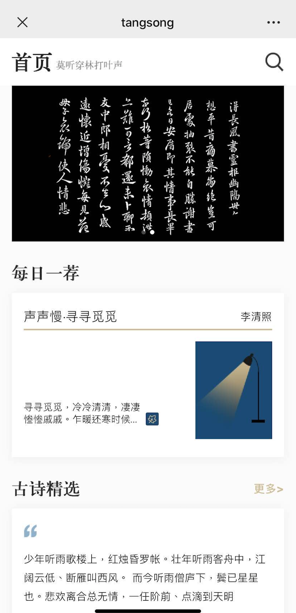

## tangsong-web
koa + mongodb + nuxt + vue  唐宋诗词网站 

终于完成我一年的梦想啦  
完成 一个全栈网站梦想  
基于 koa 和 mongodb 的接口开发系列  
基于 vue-admin的 后台管理系统  
基于 nuxt vant的h5 展示页面  
还有 微信小程序  
正正好就是  我喜欢的页面  
顺便说 里面ui也是花费了好些心思
## 项目截图

